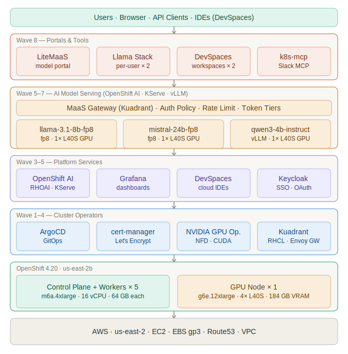

# MaaS 2.0

GitOps bootstrap for a **Model-as-a-Service (MaaS)** platform on OpenShift — multi-tenant LLM serving with self-service access via [LiteMaaS](https://github.com/anatsheh84/lite-maas).

---

## Stack Architecture



---

## Quick Start

### Prerequisites

- `oc` CLI installed and in PATH, logged in as cluster-admin
- `htpasswd` installed (`httpd-tools` on RHEL/Fedora, `apache2-utils` on Debian/Ubuntu)
- Run from the root of the cloned repo

### Deploy

Log in once, then run with zero arguments — everything else is auto-discovered:

```bash
# 1. Log in to the cluster
oc login https://api.<cluster>:6443 \
  -u kubeadmin -p <PASSWORD> \
  --insecure-skip-tls-verify

# 2. Run — no arguments needed
./setup/configure.sh
```

The script auto-discovers all values from the live cluster (API URL, AWS credentials, Hosted Zone ID, infraID, AMI, AZ, region) and handles the full deployment:

| Step | What happens |
|------|-------------|
| 1 | Verifies active `oc` session with cluster-admin privileges |
| 2 | Auto-discovers all cluster values via `oc` |
| 3 | Writes `bootstrap/values.local.yaml` — gitignored, never committed |
| 4 | Creates `cert-manager-aws-creds` secret |
| 5 | Installs OpenShift GitOps operator |
| 5b | Creates HTPasswd IDP (`user1`, `user2`, `admin`) |
| 5c | Generates LiteMaaS secrets with `openssl rand`, creates `OAuthClient` |
| 6 | Deploys ArgoCD bootstrap Application |
| 7 | Patches `helm.valuesObject` with real values — no git commit needed |

> Nothing sensitive is ever committed to git. All secrets are generated at deploy-time and stored only on the cluster.

### After deployment

Monitor ArgoCD sync progress:

```bash
oc get applications -n openshift-gitops -w
```

One manual step remains — the Slack bot token:

```bash
oc create secret generic slack-mcp-token -n lls-demo \
  --from-literal=slack-bot-token=<SLACK_BOT_TOKEN>
```

---

## Platform Overview

### Repository Layout

```
bootstrap/                   ← Root Helm chart (app-of-apps)
  values.yaml                ← Template — cluster values injected at runtime
  templates/
    applications/            ← ArgoCD Application CRs (one per component)
    extra-resources/         ← Shared cluster-scoped resources (groups, gateway, ArgoCD config)

charts/                      ← Local Helm charts per component
  machinesets/               ← AWS MachineSets (workers + GPU)
  cert-manager/              ← cert-manager Operator
  keycloak/                  ← RHBK Operator
  keycloak-instance/         ← Keycloak DB, CR, realm, route, OAuth
  litemaas/                  ← LiteMaaS portal (backend, frontend, LiteLLM, PostgreSQL, Redis)
  models-as-a-service/       ← MaaS API + Kuadrant Gateway
  ...

setup/                       ← One-time bootstrap (run once, not GitOps)
  configure.sh               ← Auto-configure + deploy (zero arguments)
  gitops-subscription.yaml   ← Install OpenShift GitOps operator
  cluster-admin-binding.yaml ← Grant cluster-admin to ArgoCD
  bootstrap.yaml             ← Deploy the root bootstrap Application
```

### Infrastructure

| Parameter | Value |
|---|---|
| Cloud | AWS `us-east-2b` |
| OpenShift | 4.20 |

| MachineSet | Instance | vCPU | RAM | GPUs | Replicas |
|---|---|---|---|---|---|
| Workers | `m6a.4xlarge` | 16 | 64 GB | — | 5 |
| GPU (active) | `g6e.12xlarge` | 48 | 192 GB | **4× NVIDIA L40S** (46 GB each, 184 GB total) | 1 |
| GPU (standby) | `g6e.2xlarge` | 8 | 32 GB | 1× NVIDIA L40S | 0 |

GPU workloads must tolerate `nvidia.com/gpu=l40-gpu:NoSchedule` and request `nvidia.com/gpu` resources.

### ArgoCD Sync Waves

**UI:** `https://openshift-gitops-server-openshift-gitops.apps.<cluster-domain>`

| Wave | Application | Description |
|------|-------------|-------------|
| 0 | `machinesets` | AWS MachineSets |
| 1 | `cert-manager` | cert-manager Operator |
| 2 | `cluster-certificates` | Let's Encrypt wildcard cert |
| 2 | `keycloak` | RHBK Operator |
| 3 | `keycloak-instance` | Keycloak DB + realm + OAuth |
| 4 | `nvidia-gpu-enablement` | NFD + NVIDIA GPU Operator |
| 4 | `openshift-ai-operator` | RHOAI Operator |
| 4 | `rhcl-operator` | Kuadrant (RHCL) |
| 4 | `grafana` | Grafana + dashboards |
| 4 | `devspaces` | OpenShift DevSpaces |
| 4 | `cluster-monitoring` | User workload monitoring |
| 5 | `openshift-ai` | DataScienceCluster operand |
| 6 | `models` | LLMInferenceServices |
| 6 | `models-as-a-service` | MaaS API + Kuadrant Gateway |
| 7 | `llama-stack-instance` | Per-user Llama Stack |
| 7 | `workspace` | Per-user DevSpaces workspace |
| 8 | `kubernetes-mcp-server` | Kubernetes MCP server |
| 8 | `slack-mcp` | Slack MCP server |
| 8 | `litemaas` | LiteMaaS portal |

---

## Models

All models are served via KServe `LLMInferenceService` in the `llm` namespace, behind the MaaS Gateway at:
`http://maas.apps.<cluster-domain>/llm/<model-name>/v1`

| Model | Status | GPU |
|---|---|---|
| `llama-3-1-8b-instruct-fp8` | ✅ Running | 1× L40S |
| `mistral-small-24b-fp8` | ✅ Running | 1× L40S |
| `qwen3-4b-instruct` | ✅ Running | 1× L40S |
| `phi-4-instruct-w8a8` | ⏸ Stopped | — |

### API Token

The MaaS Gateway (Kuadrant) requires a Kubernetes service account token. **One token works for all models** — every `LLMInferenceService` automatically creates a `RoleBinding` granting the same three tier groups access, so the enterprise tier SA token reaches any model on the cluster.

```bash
oc create token default \
  -n maas-default-gateway-tier-enterprise \
  --audience=maas-default-gateway-sa \
  --duration=8760h
```

### Adding a Model to LiteMaaS

| Field | Value |
|---|---|
| Provider | `openai` |
| Model Name | e.g. `qwen3-4b-instruct` |
| API Base | `http://maas.apps.<cluster-domain>/llm/<model-name>/v1` |
| API Key | Token from the command above |

---

## LiteMaaS Portal

[LiteMaaS](https://github.com/anatsheh84/lite-maas) is a self-service portal for model subscriptions, API key management, and usage tracking. Deployed at sync wave 8.

```
Browser → LiteMaaS Frontend (React + PatternFly)
               ↓
          LiteMaaS Backend (Fastify + PostgreSQL)
               ↓
          LiteLLM Gateway (proxy + budget enforcement)
               ↓
          MaaS Gateway (Kuadrant) → KServe model
```

### Components

| Component | Image | Role |
|---|---|---|
| Backend | `litemaas-backend:0.4.0` | API, auth, PostgreSQL |
| Frontend | `litemaas-frontend:0.4.0` | React + PatternFly 6 UI |
| LiteLLM | `litellm-non-root:main-v1.81.0-stable-custom` | Model proxy |
| PostgreSQL | `postgres:16-alpine` | Persistent storage |
| Redis | `redis:7-alpine` | LiteLLM cache |

### Secrets

All secrets are generated at deploy-time by `configure.sh` using `openssl rand` — nothing is hardcoded or committed to git. They are stored in a single Kubernetes Secret (`litemaas-secrets`) in the deployment namespace.

To regenerate (e.g. fresh install):

```bash
oc delete secret litemaas-secrets -n litemaas-test
oc login https://api.<cluster>:6443 -u kubeadmin -p <PASSWORD> --insecure-skip-tls-verify
./setup/configure.sh
```

### RBAC

LiteMaaS maps OpenShift groups to portal roles. The `admin` user is automatically added to `litemaas-admins` via `bootstrap/values.yaml`.

| OpenShift Group | LiteMaaS Role | Access |
|---|---|---|
| `litemaas-admins` | `admin` | Full — models, users, subscriptions, API keys |
| `litemaas-readonly` | `adminReadonly` | Read-only admin view |
| `litemaas-users` | `user` | Default for all authenticated users |

### Login

Use `admin`, `user1`, or `user2` from the `htpasswd-maas` IDP — **never `kube:admin`**.

> `kube:admin` is a synthetic virtual user with no `metadata.uid`. LiteMaaS requires a real UID to create a user record; logging in as `kube:admin` results in `Authentication failed`.

If your browser has an active `kube:admin` session, open an **incognito window** and select `htpasswd-maas` at the OpenShift login screen.

### Namespace Promotion

LiteMaaS deploys to `litemaas-test` for validation. To promote to production, change one line in `bootstrap/values.yaml` and push:

```yaml
litemaas:
  namespace: litemaas-test   # ← change to: litemaas
```

---

## User Guide

### Credentials

| User | Password | OpenShift Role | LiteMaaS Role |
|---|---|---|---|
| `admin` | `NDcxOTE3` (= `471917`) | cluster-admin | admin |
| `user1` | `MTkxNDU3` (= `191457`) | user | user |
| `user2` | `MTkxNDU3` (= `191457`) | user | user |

Select the **`htpasswd-maas`** IDP on the OpenShift login screen.

### Accessing Services

| Service | URL |
|---|---|
| OpenShift Console | `https://console-openshift-console.apps.<cluster-domain>` |
| ArgoCD | `https://openshift-gitops-server-openshift-gitops.apps.<cluster-domain>` |
| LiteMaaS | `https://litemaas-litemaas-test.apps.<cluster-domain>` |
| LiteLLM UI | `https://litellm-litemaas-test.apps.<cluster-domain>` |
| Grafana | `https://grafana.apps.<cluster-domain>` |
| Keycloak SSO | `https://sso.apps.<cluster-domain>` |

### First-time RHOAI Setup

After logging in to OpenShift AI, switch to your personal namespace before creating a playground — creating it in any other namespace will fail with a permissions error:

- `user1` → project `wksp-user1`
- `user2` → project `wksp-user2`

---

## Configuration Reference

### Feature Flags (`bootstrap/values.yaml`)

| Flag | Default | Effect when disabled |
|---|---|---|
| `keycloak.enabled` | `false` | Skips Keycloak operator and instance. Users authenticate via htpasswd only. |

### Keycloak (when enabled)

| Item | Value |
|---|---|
| URL | `https://sso.apps.<cluster-domain>` |
| Realm | `sso` |
| OIDC client | `idp-4-ocp` |
| OCP OAuth provider | `rhbk` |
